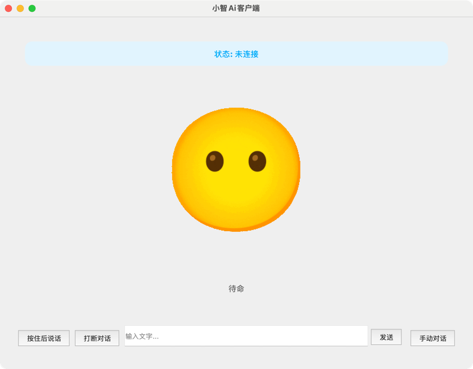

# py-xiaozhi

<p align="center">
  <a href="https://github.com/huangjunsen0406/py-xiaozhi/releases/latest">
    
  </a>
  <a href="https://opensource.org/licenses/MIT">
    
  </a>
  <a href="https://github.com/huangjunsen0406/py-xiaozhi/stargazers">
    
  </a>
  <a href="https://github.com/huangjunsen0406/py-xiaozhi/releases/latest">
    
  </a>
  <a href="https://gitee.com/huang-jun-sen/py-xiaozhi">
    
  </a>
  <a href="https://huangjunsen0406.github.io/py-xiaozhi/guide/00_%E6%96%87%E6%A1%A3%E7%9B%AE%E5%BD%95.html">
    
  </a>
</p>

简体中文 | [English](README.en.md)

## 项目简介

py-xiaozhi 是一个使用 Python 实现的小智语音客户端，旨在通过代码学习和在没有硬件条件下体验 AI 小智的语音功能。
本仓库是基于[xiaozhi-esp32](https://github.com/78/xiaozhi-esp32)移植

## 演示

- [Bilibili 演示视频](https://www.bilibili.com/video/BV1HmPjeSED2/#reply255921347937)



## 功能特点

### 🎯 核心AI功能
- **AI语音交互**：支持语音输入与识别，实现智能人机交互，提供自然流畅的对话体验
- **视觉多模态**：支持图像识别和处理，提供多模态交互能力，理解图像内容
- **智能唤醒**：支持多种唤醒词激活交互，免去手动操作的烦恼（可配置开启）
- **自动对话模式**：实现连续对话体验，提升用户交互流畅度

### 🔧 MCP工具生态系统
- **系统控制工具**：系统状态监控、应用程序管理、音量控制、设备管理等
- **日程管理工具**：全功能日程管理，支持创建、查询、更新、删除事件，智能分类和提醒
- **定时任务工具**：倒计时器功能，支持延时执行MCP工具，多任务并行管理
- **音乐播放工具**：在线音乐搜索播放，支持播放控制、歌词显示、本地缓存管理
- **12306查询工具**：12306铁路票务查询，支持车票查询、中转查询、列车路线查询
- **搜索工具**：网络搜索和网页内容获取，支持必应搜索和智能内容解析
- **菜谱工具**：丰富菜谱库，支持菜谱搜索、分类查询、智能推荐
- **地图工具**：高德地图服务，支持地理编码、路径规划、周边搜索、天气查询
- **八字命理工具**：传统八字命理分析，支持八字计算、婚姻分析、黄历查询
- **摄像头工具**：图像捕获和AI分析，支持拍照识别和智能问答

### 🏠 IoT设备集成
- **设备管理架构**：基于Thing模式的统一设备管理，支持属性和方法的异步调用
- **智能家居控制**：支持灯光、音量、温度传感器等设备控制
- **状态同步机制**：实时状态监控，支持增量更新和并发状态获取
- **可扩展设计**：模块化设备驱动，易于添加新设备类型

### 🎵 高级音频处理
- **多级音频处理**：支持Opus编解码、实时重采样
- **语音活动检测**：VAD检测器实现智能打断，支持语音活动实时监控
- **唤醒词检测**：基于Vosk的离线语音识别，支持多唤醒词和拼音匹配
- **音频流管理**：独立输入输出流，支持流重建和错误恢复

### 🖥️ 用户界面
- **图形化界面**：基于PyQt5的现代GUI，支持小智表情与文本显示，增强视觉体验
- **命令行模式**：支持CLI运行，适用于嵌入式设备或无GUI环境
- **系统托盘**：后台运行支持，集成系统托盘功能
- **全局快捷键**：支持全局快捷键操作，提升使用便捷性
- **设置界面**：完整的设置管理界面，支持配置自定义

### 🔒 安全与稳定
- **加密音频传输**：支持WSS协议，保障音频数据的安全性，防止信息泄露
- **设备激活系统**：支持v1/v2双协议激活，自动处理验证码和设备指纹
- **错误恢复**：完整的错误处理和恢复机制，支持断线重连

### 🌐 跨平台支持
- **系统兼容**：兼容Windows 10+、macOS 10.15+和Linux系统
- **协议支持**：支持WebSocket和MQTT双协议通信
- **多环境部署**：支持GUI和CLI双模式，适应不同部署环境
- **平台优化**：针对不同平台的音频和系统控制优化

### 🔧 开发友好
- **模块化架构**：清晰的代码结构和职责分离，便于二次开发
- **异步优先**：基于asyncio的事件驱动架构，高性能并发处理
- **配置管理**：分层配置系统，支持点记法访问和动态更新
- **日志系统**：完整的日志记录和调试支持
- **API文档**：详细的代码文档和使用指南

## 系统要求

### 基础要求
- **Python版本**：3.9 - 3.12
- **操作系统**：Windows 10+、macOS 10.15+、Linux
- **音频设备**：麦克风和扬声器设备
- **网络连接**：稳定的互联网连接（用于AI服务和在线功能）

### 推荐配置
- **内存**：至少4GB RAM（推荐8GB+）
- **处理器**：支持AVX指令集的现代CPU
- **存储**：至少2GB可用磁盘空间（用于模型文件和缓存）
- **音频**：支持16kHz采样率的音频设备

### 可选功能要求
- **语音唤醒**：需要下载Vosk语音识别模型
- **摄像头功能**：需要摄像头设备和OpenCV支持

## 请先看这里

- 仔细阅读 [项目文档](https://huangjunsen0406.github.io/py-xiaozhi/) 启动教程和文件说明都在里面了
- main是最新代码，每次更新都需要手动重新安装一次pip依赖防止我新增依赖后你们本地没有

[从零开始使用小智客户端（视频教程）](https://www.bilibili.com/video/BV1dWQhYEEmq/?vd_source=2065ec11f7577e7107a55bbdc3d12fce)


## 技术架构

### 核心架构设计
- **事件驱动架构**: 基于asyncio的异步事件循环，支持高并发处理
- **分层设计**: 清晰的应用层、协议层、设备层、UI层分离
- **单例模式**: 核心组件采用单例模式，确保资源统一管理
- **插件化**: MCP工具系统和IoT设备支持插件化扩展

### 关键技术组件
- **音频处理**: Opus编解码、实时重采样
- **语音识别**: Vosk离线模型、语音活动检测、唤醒词识别
- **协议通信**: WebSocket/MQTT双协议支持、加密传输
- **配置系统**: 分层配置、点记法访问、动态更新

### 性能优化
- **异步优先**: 全系统异步架构，避免阻塞操作
- **内存管理**: 智能缓存、垃圾回收
- **音频优化**: 5ms低延迟处理、队列管理、流式传输
- **并发控制**: 任务池管理、信号量控制、线程安全

### 安全机制
- **加密通信**: WSS/TLS加密、证书验证
- **设备认证**: 双协议激活、设备指纹识别
- **权限控制**: 工具权限管理、API访问控制
- **错误隔离**: 异常隔离、故障恢复、优雅降级

## 开发指南

### 项目结构
```
py-xiaozhi/
├── src/
│   ├── application.py          # 应用程序主入口
│   ├── audio_codecs/           # 音频编解码器
│   ├── audio_processing/       # 音频处理模块
│   ├── core/                   # 核心组件
│   ├── display/                # 显示界面
│   ├── iot/                    # IoT设备管理
│   ├── mcp/                    # MCP工具系统
│   ├── protocols/              # 通信协议
│   ├── utils/                  # 工具函数
│   └── views/                  # 视图组件
├── config/                     # 配置文件
├── models/                     # 语音模型
├── assets/                     # 资源文件
└── libs/                       # 第三方库
```

### 开发环境设置
```bash
# 克隆项目
git clone https://github.com/huangjunsen0406/py-xiaozhi.git
cd py-xiaozhi

# 安装依赖
pip install -r requirements.txt

# 代码格式化
./format_code/sh

# 运行程序
python3.9 main.py
```

### 核心开发模式
- **异步优先**: 使用`async/await`语法，避免阻塞操作
- **错误处理**: 完整的异常处理和日志记录
- **配置管理**: 使用`ConfigManager`统一配置访问
- **测试驱动**: 编写单元测试，确保代码质量

### 扩展开发
- **添加MCP工具**: 在`src/mcp/tools/`目录创建新工具模块
- **添加IoT设备**: 继承`Thing`基类实现新设备
- **添加协议**: 实现`Protocol`抽象基类
- **添加界面**: 扩展`BaseDisplay`实现新的UI组件

### 状态流转图
```
                        +----------------+
                        |                |
                        v                |
+------+  唤醒词/按钮  +------------+   |   +------------+
| IDLE | -----------> | CONNECTING | --+-> | LISTENING  |
+------+              +------------+       +------------+
   ^                                            |
   |                                            | 语音识别完成
   |          +------------+                    v
   +--------- |  SPEAKING  | <-----------------+
     完成播放 +------------+
```

## 贡献指南

欢迎提交问题报告和代码贡献。请确保遵循以下规范：

1. 代码风格符合PEP8规范
2. 提交的PR包含适当的测试
3. 更新相关文档

## 社区与支持

### 感谢以下开源人员
>
> 排名不分前后

[Xiaoxia](https://github.com/78)
[zhh827](https://github.com/zhh827)
[四博智联-李洪刚](https://github.com/SmartArduino)
[HonestQiao](https://github.com/HonestQiao)
[vonweller](https://github.com/vonweller)
[孙卫公](https://space.bilibili.com/416954647)
[isamu2025](https://github.com/isamu2025)
[Rain120](https://github.com/Rain120)
[kejily](https://github.com/kejily)
[电波bilibili君](https://space.bilibili.com/119751)

### 赞助支持

<div align="center">
  <h3>感谢所有赞助者的支持 ❤️</h3>
  <p>无论是接口资源、设备兼容测试还是资金支持，每一份帮助都让项目更加完善</p>
  
  <a href="https://huangjunsen0406.github.io/py-xiaozhi/sponsors/" target="_blank">
    
  </a>
  <a href="https://huangjunsen0406.github.io/py-xiaozhi/sponsors/" target="_blank">
    
  </a>
</div>

## 项目统计

[](https://www.star-history.com/#huangjunsen0406/py-xiaozhi&Date)

## 许可证

[MIT License](LICENSE)
